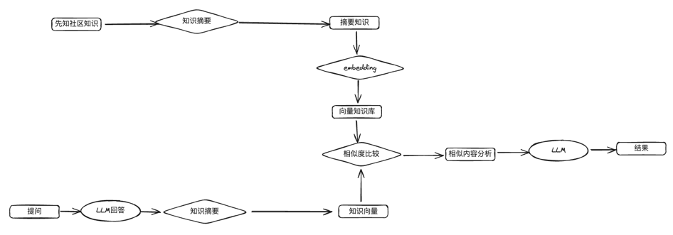

# 基于LLM的先知社区知识库
本项目的开发初衷是为了方便检索先知社区的文章，在ctf比赛中能够基于
llm快速筛选到有用的文章并生成一个结果
## 实现原理
本项目基于先知社区的知识内容构建了一个向量知识库，通过llm能够实现基于先知内容的回答，具体内容参见如下流程图：

## 文章目录
知识库的文章构建范围为：7023～12923，共计2898篇
## 使用方式
1. 在env中填写gemini api：
```bash
GOOGLE_API_KEY = AIzaSyA9cKkm4U65BPksk-pVgHmclxxxxxxxxxxx
```
2. 在DocumentStore中补充相应范围的先知社区文章,详细的先知文章参考范围参见`xianzhi_index.json`
### 示例
- 问题：k8s存在哪些漏洞
```bash
['https://xz.aliyun.com/t/12437', 'https://xz.aliyun.com/t/12055', 'https://xz.aliyun.com/t/11138', 'https://xz.aliyun.com/t/8000', 'https://xz.aliyun.com/t/11890']
## 分析安全问题

Kubernetes（k8s）是一个开源容器编排系统，它存在以下漏洞：

* **容器逃逸：**攻击者可以从容器中逃逸到主机操作系统，从而获得对底层系统的访问权限。
* **特权提升：**攻击者可以提升容器内的权限，从而获得对集群的控制权。
* **网络攻击：**攻击者可以利用网络配置错误或漏洞来访问或破坏集群中的容器。
* **数据泄露：**攻击者可以访问或窃取存储在容器中的敏感数据。
* **拒绝服务（DoS）：**攻击者可以发起DoS攻击，使集群中的容器或服务不可用。

## 对参考答案的分析

参考答案1、2、3、4、5都列出了k8s存在的漏洞，但内容有所不同。

* **参考答案1**提供了最全面的漏洞列表，涵盖了容器逃逸、特权提升、网络安全、数据泄露、拒绝服务、供应链攻击、配置错误、API安全、镜像漏洞和编排漏洞。
* **参考答案2**提供了具体CVE编号的漏洞，但数量较少。
* **参考答案3**提供了与参考答案1类似的漏洞列表，但缺少了供应链攻击和编排漏洞。
* **参考答案4**没有提供任何漏洞信息。
* **参考答案5**提供了与参考答案1类似的漏洞列表，但缺少了供应链攻击和编排漏洞，并增加了Kubernetes API服务器漏洞和网络策略绕过。

## 根据有用的参考答案回答问题

根据参考答案1、3和5，k8s存在的漏洞包括：

* 容器逃逸
* 特权提升
* 网络攻击
* 数据泄露
* 拒绝服务
* 配置错误
* Kubernetes API服务器漏洞（参考答案5）
* 网络策略绕过（参考答案5）
```
## 注意
本项目仅做研究使用，切勿用于任何违法行为
